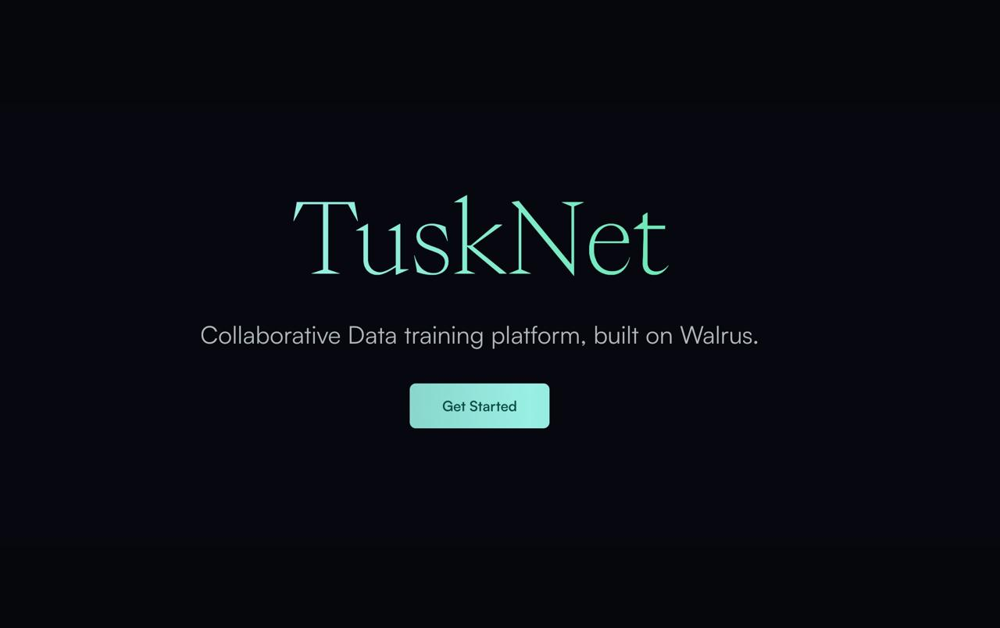
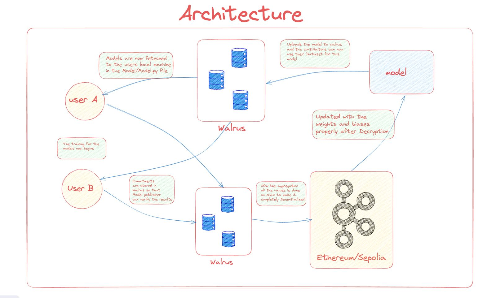

## TuskNet

<b>Your Data, Your Control</b> 
<b>Collective Intelligence, Powered by Walrus.</b>

Say Hi to TuskNet!  A decentralized platform built on the Walrus network, designed to enable secure and privacy-preserving model training across distributed datasets. It ensures that sensitive data remains confidential by leveraging advanced cryptographic methods, including Pedersen commitments, to safeguard model parameters (weights and biases) throughout the training process.

**Read our wonderful docs [here](https://tusknet.gitbook.io/tusknet).**

## Key Features and Architecture

</img>

1. **BlockChain Coordination (Walrus)**

    TuskNet leverages Walrus' power to manage node registration, emit real-time events, and securely aggregate encrypted data—all seamlessly and without compromise. It ensures every contributor can participate in the process, confident that their efforts are secure and valued.

2. **Privacy-Preserving Model Training**

    We live in a world where data privacy is no longer optional—it is a necessity. TuskNet embraces this by employing Pedersen commitments, a cutting-edge cryptographic method that ensures your data and model parameters remain confidential.

3. **Decentralized Node Participation**

    In the past, access to advanced AI development was reserved for the few—those with vast resources and centralized control. TuskNet flips this paradigm on its head. Now, anyone with data can participate as a node in a trustless ecosystem.

4. **Encrypted Aggregation**

    With TuskNet, nodes submit encrypted model updates—weights and biases—that are aggregated on-chain by smart contracts on the Walrus network. The result? A seamless integration of contributions, enabling better AI models without ever exposing private data.

